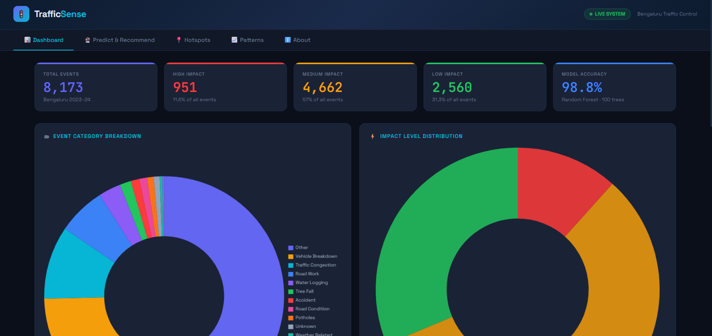
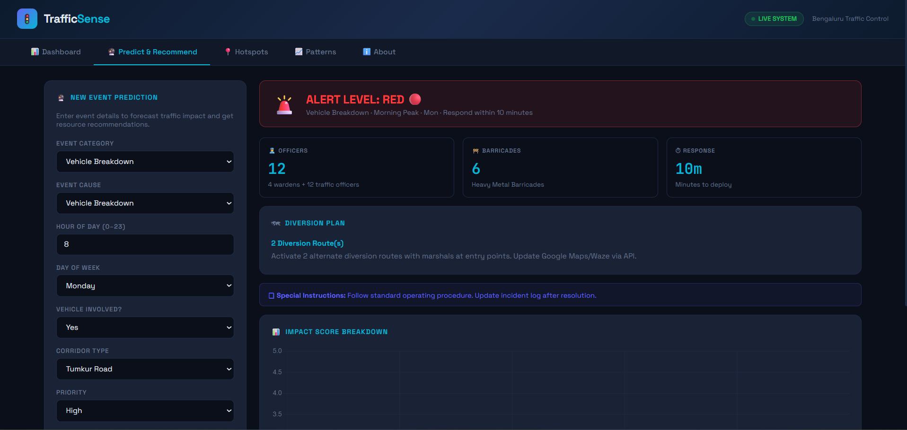

# TrafficSense

TrafficSense is a Flask dashboard and static demo for analyzing Bengaluru traffic incident data, visualizing trends, and generating response recommendations.

## Screenshots

### Dashboard Overview


### Predict & Recommendations Panel


## Project Structure
- `app.py` — Flask application entry point
- `templates/Demo_Dashboard.html` — full dashboard UI used by the Flask app
- `index.html` — root dashboard file for GitHub Pages demo hosting
- `static/` — optional CSS/JS assets used by the app
- `Data/` — datasets used for analysis
- `models/` — trained model artifacts

## How to Run Locally
1. Create and activate a virtual environment (optional but recommended)
2. Install dependencies:
   ```bash
   pip install -r requirements.txt
   ```
3. Start the app:
   ```bash
   python app.py
   ```
4. Open the dashboard in your browser:
   ```text
   http://127.0.0.1:5000
   ```

## GitHub Pages / Demo Link
- The root [index.html](index.html) file is the page used for GitHub Pages deployment.
- If you host the repo on GitHub Pages, the homepage will open the full dashboard directly.

## Notes
- The dashboard is designed for both local Flask use and static GitHub Pages demo hosting.
